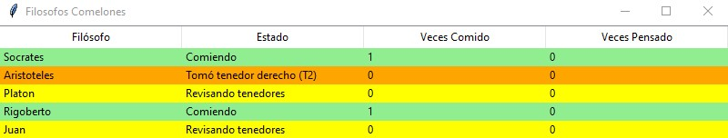

# Filósofos Comelones

## 🔍 Descripción del problema
Cinco filósofos están sentados alrededor de una mesa circular.
Cada filósofo tiene un plato de espagueti. El espagueti es tan resbaloso, que un filósofo necesita dos tenedores para comerlo. Entre cada par de platos hay un tenedor. 

La vida de un filósofo consiste en periodos alternos de comer y pensar (esto es algo así como una abstracción, incluso para los filósofos, pero las otras actividades son irrelevantes aquí). Cuando un filósofo tiene hambre, trata de adquirir sus tenedores izquierdo y derecho, uno a la vez, en cualquier orden. Si tiene éxito al adquirir dos tenedores, come por un momento, después deja los tenedores y continúa pensando.

## ⚙️ Tecnologías y Librerías Utilizadas
- `threading` - Manejo de hilos
- `concurrent.futures` - Ejecución de tareas en paralelo
- `time` - Simulación de tiempos de espera
- `random` - Generación de tiempos aleatorios para la simulación de los filosofos comiendo (en este caso se asigna con base un rango de tiempo, por ejemplo entre 2 y 5 segundos)
- `tkinter` - Interfaz gráfica para la visualización de estados de los filósofos

## 📖 Enfoque de la solución: OOP
Para llegar a la solución del programa, se realizó un enfoque con la Programación Orientada a Objetos (OOP). La implementación se estructura en clases para una mejor organización para el comportamiento de los filósofos:

### 🧠 Clase Filósofo
- `Clase Filosofo`: Modela el comportamiento de cada filósofo. Además icluye ciertos atributos para mostrar su comportamiento en la tabla.

### 🛠️ Métodos Principales:

- `revisarTenedores()`: Intenta adquirir ambos tenedores después de haber terminado de comer.
- `comer()`: Simula el tiempo de comida.
- `pensar()`: Simula el tiempo de pensamiento.

### 🚦 Semáforos y Tenedores
Cabe destacar que los tenedores no son un atributo de los filósofos, estos son decalrados en el programa general puesto que únicamente existe 5 recursos / tenedores disponibles para todos los filósofos, los cuales pueden ser tomados únicamente si están disponibles en la mesa.

Teniendo esto en cuenta, los tenedores funcionan como semáforos, y para ello se utiliza `threading.semaphore` junto con `.acquire` y `release` para que los filósofos puedan tomar y dejar los recursos disponibles

## Interfaz Gráfica

- 🟡 Revisando tenedores
- 🟠 Tomando un tenedor
- 🟢 Comiendo
- 🔴 Soltando un tenedor
- 🔵 Pensando

## 🚀 Ejemplo de uso

